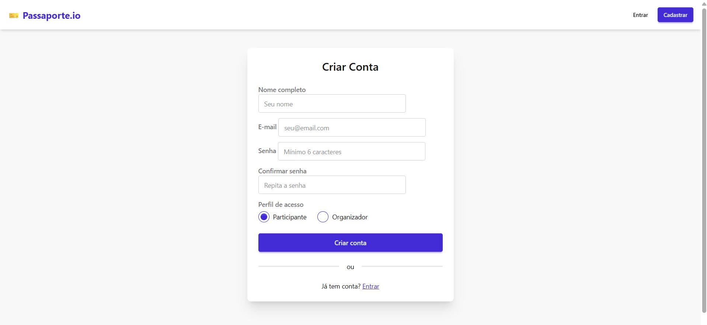
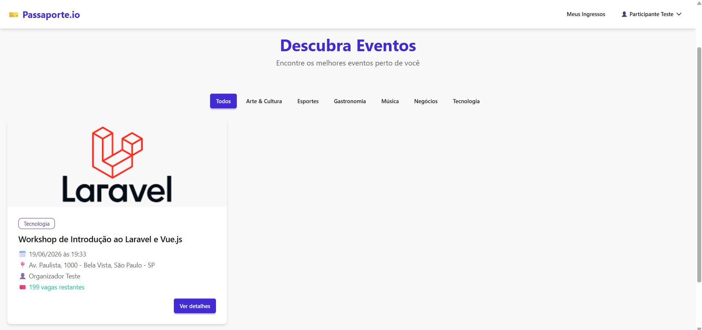
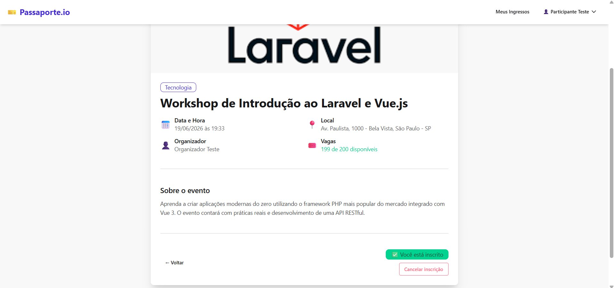
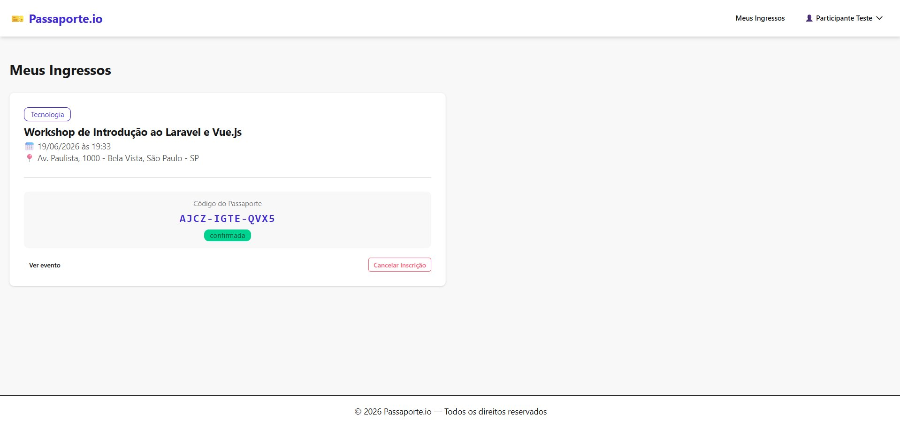
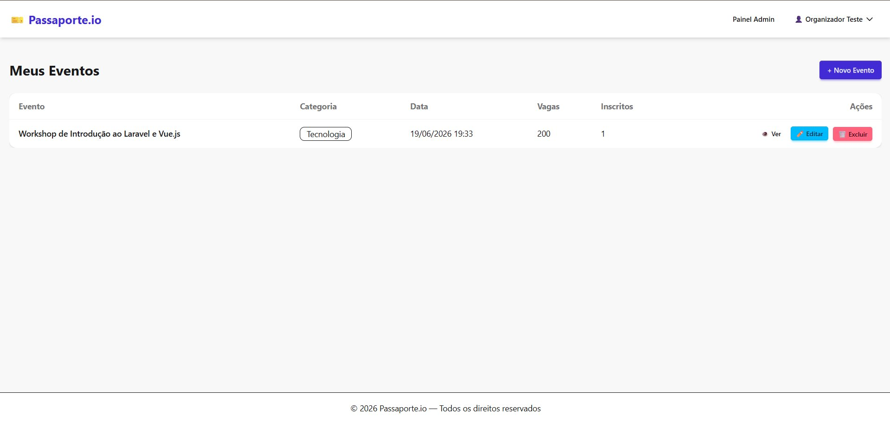
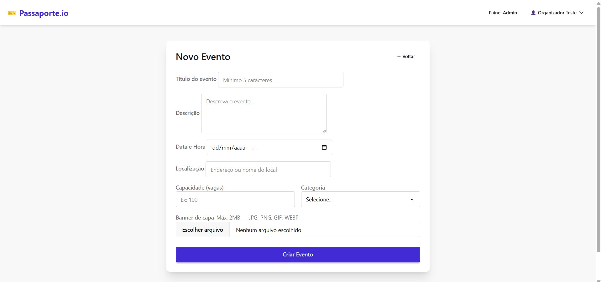

# 🎫 Passaporte.io

Sistema de Gestão de Eventos e Ingressos — Atividade Prática Avaliativa  
**Disciplina:** Programação Web III | **Professor:** Salomão

---

## 🛠 Requisitos de Ambiente

| Ferramenta | Versão utilizada |
|---|---|
| PHP | 8.2.x |
| Laravel | 12.x |
| Composer | 2.x |
| Node.js | 24.x |
| NPM | 11.x |
| Banco de dados | MySQL (XAMPP) |

---

## 🚀 Passo a Passo de Inicialização

### 1. Clone o repositório e entre na pasta
```bash
git clone <https://github.com/PedroTersiSouza/-passaporte-io.git>
cd passaporte-io
```

### 2. Instale as dependências PHP
```bash
composer install
```

### 3. Instale as dependências Node (Tailwind + DaisyUI)
```bash
npm install
```

### 4. Configure o ambiente
```bash
cp .env.example .env
php artisan key:generate
```

Edite o `.env` com suas credenciais MySQL:
```env
DB_CONNECTION=mysql
DB_HOST=127.0.0.1
DB_PORT=3306
DB_DATABASE=passaporte_io
DB_USERNAME=root
DB_PASSWORD=
```

> Crie o banco `passaporte_io` no phpMyAdmin antes de rodar as migrations.

### 5. Crie o link simbólico do storage
```bash
php artisan storage:link
```

### 6. Rode as migrations com os seeders
```bash
php artisan migrate:fresh --seed
```

### 7. Compile os assets (CSS/JS)
```bash
npm run build
```

### 8. Inicie o servidor
```bash
php artisan serve
```

Acesse: **http://localhost:8000**

---

## 🔐 Credenciais de Teste

### Organizador
| Campo | Valor |
|---|---|
| E-mail | `organizador@passaporte.io` |
| Senha | `password` |

### Participante
| Campo | Valor |
|---|---|
| E-mail | `participante@passaporte.io` |
| Senha | `password` |

---

## 📸 Capturas de Tela

### Cadastro de Usuário


### Vitrine Pública de Eventos


### Detalhes do Evento


### Histórico de Inscrições (Meus Ingressos)


### Painel do Organizador


### Criação de Evento


---

## 📁 Estrutura Resumida

```
app/
├── Http/
│   ├── Controllers/
│   │   ├── AuthController.php
│   │   ├── PublicEventController.php
│   │   ├── AdminEventController.php
│   │   └── InscriptionController.php
│   └── Middleware/
│       ├── EnsureOrganizador.php
│       └── EnsureParticipante.php
├── Models/
│   ├── User.php
│   ├── Event.php
│   └── Category.php
database/
├── migrations/
└── seeders/
resources/views/
├── layouts/app.blade.php
├── auth/
├── public/events/
├── admin/events/
└── participant/
```

---

## ✅ Checklist de Requisitos Implementados

- [x] RF01–RF03 Autenticação (registro com perfil, login, logout)
- [x] RF04–RF07 Backoffice do organizador (CRUD de eventos)
- [x] RF08–RF11 Motor de inscrições com geração de ticket_code
- [x] RF12–RF14 Portal público com filtragem por categoria
- [x] RN01 Validação de data retroativa
- [x] RN02 Validação de banner (imagem, max 2MB)
- [x] RN03 Bloqueio de exclusão com inscritos
- [x] RN04 Unicidade de inscrição (constraint no banco + validação)
- [x] RN05 Limite de capacidade (vagas esgotadas)
- [x] RN06 Organizador não pode se inscrever
- [x] RN07 user_id vinculado via auth(), não por input oculto
- [x] RN08 E-mail único no sistema
- [x] RN09 Bloqueio de edição transversal
- [x] RNF01 Foreign keys com restrictOnDelete
- [x] RNF02 Tabela pivô com withTimestamps()
- [x] RNF03 Senhas com bcrypt (cast 'hashed')
- [x] RNF04 Eager loading (with(['organizer','category']))
- [x] RNF05 Paginação no painel e histórico
- [x] RNF06 Query binding nativo do Eloquent
- [x] RNF07 @csrf em todos os formulários de escrita
- [x] RNF08–RNF09 Upload com Storage::disk('public') e UUID
- [x] RNF10 Flash messages com alert-success / alert-error
- [x] RNF11 old() para preservar estado dos formulários
